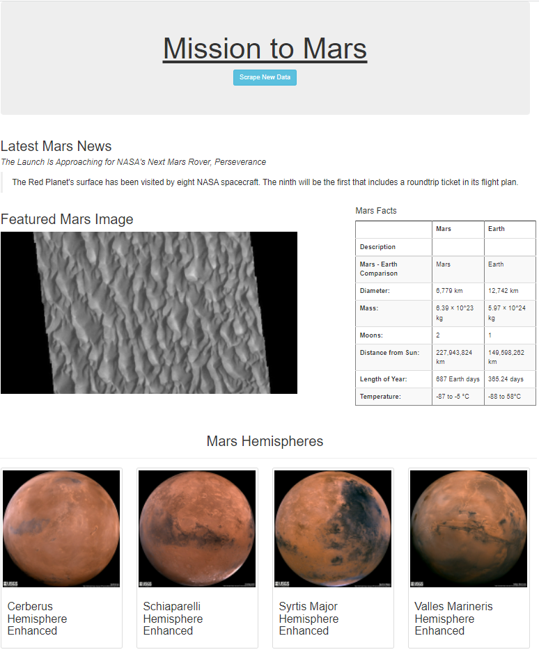

# Mission-to-Mars

## Project Overview
The purpose of this project is to create a webscraping application that takes information from different space related websites and organize it using a Flask web framework.

### Purpose
In this project I used splinter and beautifulsoup to go to different web pages filter through and scrape data. The data consisted of tables headlines and pictures from a variety of different sites. This data was placed in MongoDB. I 
then created a flask application to aggregate the information and created an HTML template file. The flask application created took the scraped data requested and formatted it into a web application. 

Below is the Flask application created:

